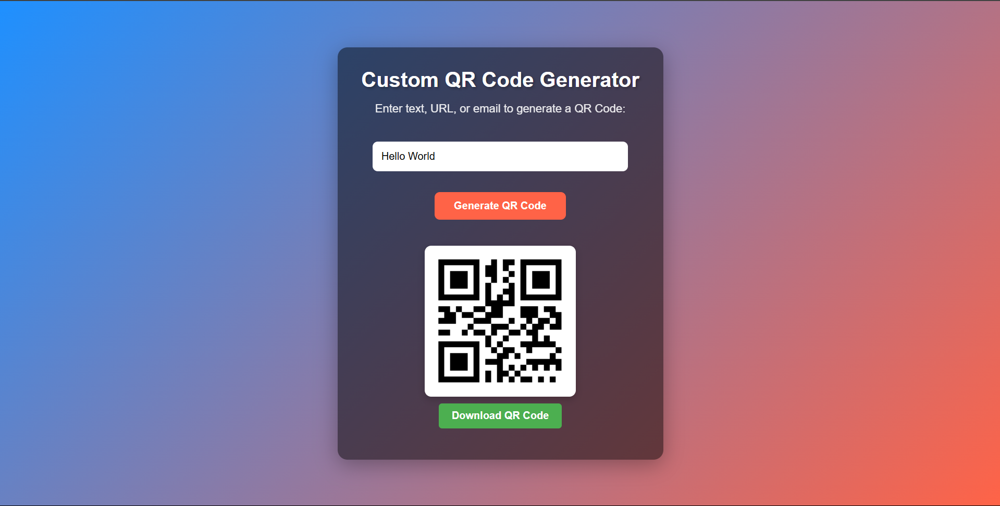

# QR Code Generator

A simple, modern web-based QR Code Generator that allows users to create QR codes from text, URLs, or emails. This project uses HTML, CSS, and JavaScript along with the QR.js library to generate scannable QR codes and download them in PNG format.

## Features

- Generate QR codes for any text, URL, or email.
- Download the generated QR code as a PNG image.
- Simple, responsive design with a user-friendly interface.

## Tech Stack

- **HTML**: Markup for the structure of the webpage.
- **CSS**: Styling for the webpage.
- **JavaScript**: Logic for generating the QR code and handling user interactions.
- **QR.js**: A library to generate QR codes.

## Demo

You can view a live demo of this project [here](https://dulsara30.github.io/QR-Code-Generator/index.html).

## Getting Started

To run this project locally on your machine:

1. Clone the repository:

   ```bash
   git clone https://github.com/your-username/qr-code-generator.git

   ```

2. Navigate to the project folder:

   ```bash
   cd qr-code-generator

   ```

3. Open the index.html file in your browser:
   ```bash
   open index.html  # MacOS
   start index.html # Windows
   ```

## Usage

1.  Enter any text, URL, or email in the input field.
2.  Click the "Generate QR Code" button.
3.  The QR code will be displayed on the screen.
4.  You can download the QR code by clicking the "Download QR Code" button.

## Screenshots



## Contributing

Feel free to fork this repository and submit pull requests. You can help make this project better by contributing your ideas and improvements!
